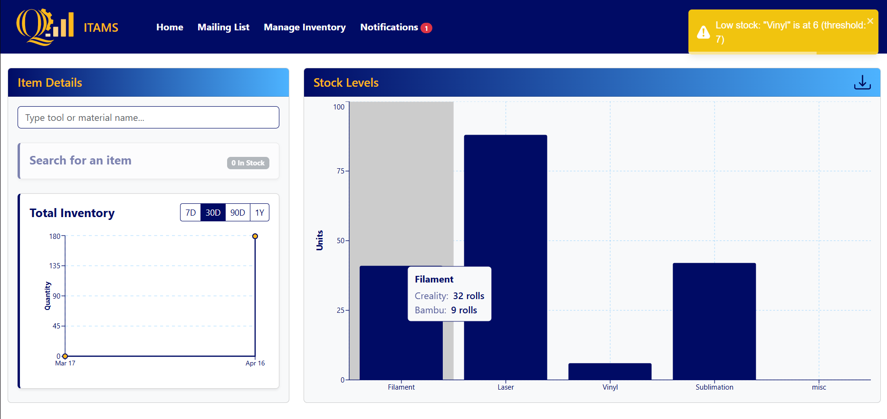
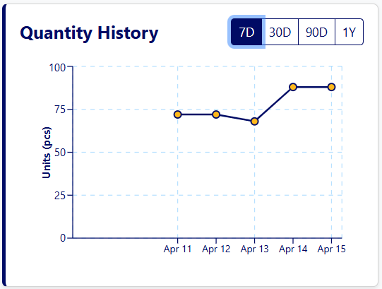
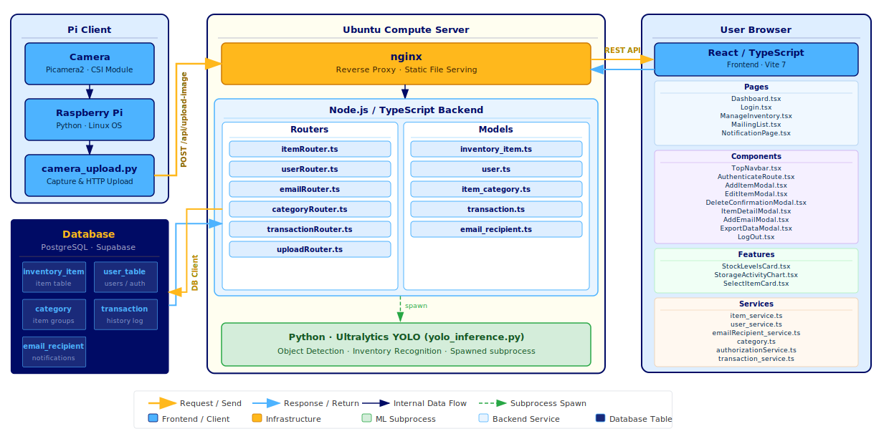

<!-- AI-assisted: Claude Code (Anthropic) — https://claude.ai/claude-code
     Structure, deployment guide, schema tables, and architecture summary generated with AI assistance.
     Reviewed and validated by the project team. -->

<p align="center">
  
</p>

# Makerspace Inventory Tracking and Management System (ITAMS)

A full-stack, real-time inventory management system built for the Quinnipiac University MakerSpace. ITAMS replaces manual paper-based tracking with a live web dashboard, automated low-stock alerting, scheduled email summaries, and optional computer-vision-assisted counting via Raspberry Pi cameras.

**Team:** Jean LaFrance · Oscar Lin · Calvin Pancavage · Brandon McCrave  
**Course:** SER492 — Senior Capstone II, Quinnipiac University

---

<p align="center">
  
  <br/>
  <em>Live dashboard — real-time stock levels by category, item search, total inventory trend, and a low-stock toast alert</em>
</p>

---

## Table of Contents

1. [Features](#features)
2. [Tech Stack](#tech-stack)
3. [System Architecture](#system-architecture)
4. [Repository Structure](#repository-structure)
5. [Local Development](#local-development)
6. [Production Deployment](#production-deployment)
7. [Raspberry Pi Setup](#raspberry-pi-setup)
8. [YOLO Model](#yolo-model)
9. [Maintenance Reference](#maintenance-reference)

---

## Features

| Feature                   | Description                                                                                                                                                      |
| ------------------------- | ---------------------------------------------------------------------------------------------------------------------------------------------------------------- |
| **Live Dashboard**        | Bar chart of current stock grouped by category, updates in real time via Server-Sent Events                                                                      |
| **Item Search & History** | Autocomplete search with per-item quantity history chart (7d / 30d / 90d / 1y) — see screenshot below                                                            |
| **Role-Based Access**     | Standard users can view and adjust quantities; admins can create, delete, and manage the full catalog                                                            |
| **Low-Stock Alerts**      | In-app toast + Notifications page when any item crosses its threshold; alert email fired at the moment of crossing (toast visible in dashboard screenshot above) |
| **Email Reporting**       | Scheduled daily and weekly inventory summaries sent to a configurable mailing list                                                                               |
| **Data Export**           | Download transaction history as a filtered CSV from the dashboard                                                                                                |
| **Computer Vision**       | Raspberry Pi cameras submit images → YOLO26 counts objects → quantities updated automatically                                                                    |

<p align="center">
  
  <br/>
  <em>Per-item quantity history — switchable between 7d, 30d, 90d, and 1y timeframes</em>
</p>

---

## Tech Stack

| Layer           | Technology                                                                      |
| --------------- | ------------------------------------------------------------------------------- |
| Frontend        | React 19 + TypeScript, Vite, React Router v7, React-Bootstrap, Recharts, Axios  |
| Backend         | Express 5 + TypeScript, Node.js 20, tsx (ESM loader)                            |
| Database        | Supabase (PostgreSQL + Realtime WebSocket)                                      |
| Auth            | JWT (24h expiry, bcrypt password hashing)                                       |
| Real-time       | Supabase Realtime → Server-Sent Events fan-out                                  |
| Email           | Nodemailer (Ethereal test account by default — see [Email Notes](#email-notes)) |
| Scheduling      | node-cron                                                                       |
| ML Inference    | YOLO26 (Ultralytics) via Python subprocess                                      |
| Pi Client       | Python + picamera2                                                              |
| Web Server      | Nginx (reverse proxy + static file serving)                                     |
| Process Manager | PM2                                                                             |

---

## System Architecture

<p align="center">
  
</p>

The Pi Client submits images over HTTP to Nginx, which reverse-proxies all `/api/` traffic to the Node.js backend running on port 3000. The backend reads and writes to Supabase (PostgreSQL), subscribes to Supabase Realtime for change events, and fans those events out to connected browsers over Server-Sent Events. YOLO inference runs as a Python subprocess spawned on demand by the upload router.

---

## Repository Structure

```
MakerSpace-ITAMS/
├── makerspace-frontend/     # React SPA
│   ├── src/
│   │   ├── components/      # Pages, panels, modals
│   │   ├── services/        # Axios API wrappers
│   │   ├── context/         # Auth + notification providers
│   │   └── assets/
│   ├── .env.example
│   └── package.json
│
├── makerspace-backend/      # Express API
│   ├── src/
│   │   ├── router/          # Route handlers (item, category, email, upload, user, transaction)
│   │   ├── models/          # TypeScript model classes
│   │   ├── server.ts        # Entry point — mounts routers, SSE, cron jobs
│   │   └── config.sample.json
│   ├── .env.example
│   └── package.json
│
├── python-backend/          # YOLO inference subprocess
│   ├── yolo_inference.py
│   └── models/best.pt       # Trained model weights
│
├── Pi/                      # Raspberry Pi camera client
│   ├── camera_upload.py
│   ├── .env.example
│   └── requirements.txt
│
└── docs/
    ├── api-contract.md
    ├── DemoImages/
    └── SystemArchitecture/
        ├── archtiecture.svg  # System architecture diagram
        ├── DB_Design.png     # Database schema diagram
        └── SequenceDiagramPNG/
```

---

## Local Development

### Prerequisites

- **Node.js 20+** — `node --version`
- **npm 10+** — `npm --version`
- **Python 3.10+** (only needed if running YOLO locally) — `python3 --version`
- A **Supabase** project with the schema applied (see [Database Schema](#database-schema))

### 1. Clone the repository

```bash
git clone <repo-url>
cd MakerSpace-ITAMS
```

### 2. Backend — configuration

The backend uses two separate configuration files.

**`makerspace-backend/src/config.json`** — Supabase credentials (copy from `config.sample.json`):

```json
{
  "VITE_SUPABASE_URL": "https://<project-ref>.supabase.co",
  "VITE_SUPABASE_PUBLISHABLE_KEY": "<your-supabase-anon-key>"
}
```

Find these in your Supabase project under **Settings → API**.

**`makerspace-backend/.env`** — runtime secrets (copy from `.env.example`):

```env
PORT=3000
JWT_SECRET=<a-long-random-secret-string>
PI_API_KEY=<any-key-you-choose-must-match-Pi-env>
PYTHON_VENV_PATH=/path/to/venv/bin/python3
PYTHON_SCRIPT_PATH=/path/to/python-backend/yolo_inference.py
```

> `JWT_SECRET` should be a long random string (e.g., output of `openssl rand -hex 32`).

### 3. Backend — install and run

```bash
cd makerspace-backend
npm install
npm start          # tsx watch — hot-reloads on file changes
```

The API will be available at `http://localhost:3000/api`.

### 4. Frontend — configuration

**`makerspace-frontend/.env`** (copy from `.env.example`):

```env
VITE_API_URL=http://localhost:3000/api
```

### 5. Frontend — install and run

```bash
cd makerspace-frontend
npm install
npm run dev        # Vite dev server, usually http://localhost:5173
```

### Database Schema

The five tables required are `user_table`, `inventory_item`, `category`, `transaction`, and `email_recipient`. The schema diagram is at [`docs/SystemArchitecture/DB_Design.png`](docs/SystemArchitecture/DB_Design.png). A summary of each table:

| Table             | Key columns                                                                                          |
| ----------------- | ---------------------------------------------------------------------------------------------------- |
| `user_table`      | `username` (PK), `hash` (bcrypt), `is_admin`                                                         |
| `inventory_item`  | `item_id` (PK), `category_id` (FK), `item_name`, `quantity`, `threshold`, `yolo_labels`, `camera_id` |
| `category`        | `category_id` (PK), `category_name`, `units`                                                         |
| `transaction`     | `transaction_id` (PK), `item_id` (FK), `quantity`, `recorded_at`                                     |
| `email_recipient` | `email` (PK), `alert_notifications`, `daily_notifications`, `weekly_notifications`                   |

Enable **Supabase Realtime** on the `inventory_item` and `transaction` tables:  
Supabase Dashboard → **Database → Replication → Tables** → toggle both on.

### Creating the first admin account

User accounts are managed directly in the database. Insert a row into `user_table` with a bcrypt-hashed password:

```sql
-- In the Supabase SQL editor
INSERT INTO user_table (username, hash, is_admin)
VALUES (
  'admin',
  '$2b$10$...',   -- generate with: node -e "const b=require('bcrypt'); b.hash('yourpassword',10).then(console.log)"
  true
);
```

### Email Notes

By default the backend uses **Ethereal** (a fake SMTP service from Nodemailer) — emails are captured and a preview URL is written to the server log instead of delivered. This is fine for development and demo purposes.

To enable real email delivery, replace the transporter in `makerspace-backend/src/server.ts` with your SMTP credentials:

```typescript
const transporter = nodemailer.createTransport({
  host: 'smtp.example.com',
  port: 587,
  secure: false,
  auth: { user: 'user@example.com', pass: 'password' },
});
```

---

## Production Deployment

This section documents how to recreate the production server from scratch. The current deployment runs on an Ubuntu Linux server at `<server-ip>` on the QU network.

### Server Prerequisites

SSH into the server and install the required system packages:

```bash
# Update package lists
sudo apt update && sudo apt upgrade -y

# Node.js 20 (via NodeSource)
curl -fsSL https://deb.nodesource.com/setup_20.x | sudo -E bash -
sudo apt install -y nodejs

# Verify
node --version   # should be v20.x
npm --version

# Python 3 and pip
sudo apt install -y python3 python3-pip python3-venv

# Nginx
sudo apt install -y nginx

# PM2 (global)
sudo npm install -g pm2
```

### Directory Layout on the Server

All application files live under `/var/www/ITAMS/`. Create the structure:

```bash
sudo mkdir -p /var/www/ITAMS/{frontend,backend-node,backend-python,data/images}
sudo chown -R $USER:www-data /var/www/ITAMS
sudo chmod -R 775 /var/www/ITAMS
```

| Path                             | Contents                           |
| -------------------------------- | ---------------------------------- |
| `/var/www/ITAMS/frontend/`       | Built React static files (`dist/`) |
| `/var/www/ITAMS/backend-node/`   | Express backend source             |
| `/var/www/ITAMS/backend-python/` | Python YOLO service + virtualenv   |
| `/var/www/ITAMS/data/images/`    | Pi-uploaded camera images          |

### Deploy the Backend

```bash
# Copy or clone the backend source
cp -r makerspace-backend/. /var/www/ITAMS/backend-node/

cd /var/www/ITAMS/backend-node
npm install

# Create config.json with Supabase credentials
cat > src/config.json << 'EOF'
{
  "VITE_SUPABASE_URL": "https://<project-ref>.supabase.co",
  "VITE_SUPABASE_PUBLISHABLE_KEY": "<your-supabase-anon-key>"
}
EOF

# Create .env
cat > .env << 'EOF'
PORT=3000
JWT_SECRET=<your-jwt-secret>
PI_API_KEY=<your-pi-api-key>
PYTHON_VENV_PATH=/var/www/ITAMS/backend-python/venv/bin/python3
PYTHON_SCRIPT_PATH=/var/www/ITAMS/backend-python/yolo_inference.py
EOF
```

### Deploy the Python / YOLO Service

```bash
# Copy inference script
cp python-backend/yolo_inference.py /var/www/ITAMS/backend-python/

# Create and activate a virtual environment
cd /var/www/ITAMS/backend-python
python3 -m venv venv
source venv/bin/activate

# Install ML dependencies
pip install ultralytics pillow

deactivate

# Place the trained model weights
mkdir -p /var/www/ITAMS/backend-python/models
# Copy best.pt here
cp /path/to/best.pt /var/www/ITAMS/backend-python/models/best.pt
```

### Build and Deploy the Frontend

Build the frontend with Vite, then copy the output to the server:

```bash
cd makerspace-frontend
npm install
npm run build          # Vite outputs to dist/

# Copy the build output to the server
scp -r dist/. user@<server-ip>:/var/www/ITAMS/frontend/
```

### Configure Nginx

**Step 1 — Main nginx config** (`/etc/nginx/nginx.conf`):

```nginx
user www-data;
worker_processes auto;
pid /run/nginx.pid;
error_log /var/log/nginx/error.log;
include /etc/nginx/modules-enabled/*.conf;

events {
    worker_connections 768;
}

http {
    sendfile on;
    tcp_nopush on;
    types_hash_max_size 2048;
    include /etc/nginx/mime.types;
    default_type application/octet-stream;

    ssl_protocols TLSv1.2 TLSv1.3;
    ssl_prefer_server_ciphers on;

    access_log /var/log/nginx/access.log;
    gzip on;

    include /etc/nginx/conf.d/*.conf;
    include /etc/nginx/sites-enabled/*;
}
```

**Step 2 — Site config** — create `/etc/nginx/sites-available/itams`:

```nginx
server {
    listen 80;
    server_name <server-ip>;   # replace with your server's IP or domain

    root /var/www/ITAMS/frontend;
    index index.html;

    include /etc/nginx/mime.types;
    default_type application/octet-stream;

    # React SPA — all non-file routes fall back to index.html
    location / {
        root /var/www/ITAMS/frontend;
        index index.html;
        try_files $uri $uri/ /index.html =404;
    }

    # Explicit asset handling for correct MIME types
    location /assets/ {
        root /var/www/ITAMS/frontend;
        include /etc/nginx/mime.types;
    }

    # Node.js API proxy — supports WebSocket upgrades (needed for SSE)
    location /api/ {
        proxy_pass http://localhost:3000;
        proxy_http_version 1.1;
        proxy_set_header Upgrade $http_upgrade;
        proxy_set_header Connection 'upgrade';
        proxy_set_header Host $host;
        proxy_cache_bypass $http_upgrade;
    }

    # Pi-uploaded images
    location /images/ {
        alias /var/www/ITAMS/data/images/;
        autoindex on;
    }
}
```

**Step 3 — Enable the site and reload:**

```bash
sudo ln -s /etc/nginx/sites-available/itams /etc/nginx/sites-enabled/itams
sudo nginx -t                        # test config — must say "syntax is ok"
sudo systemctl reload nginx
sudo systemctl enable nginx          # auto-start on boot
```

### Start Services with PM2

Create the PM2 ecosystem config at `/var/www/ITAMS/ecosystem.config.js`:

```javascript
module.exports = {
  apps: [
    {
      name: 'itams-backend',
      script: './src/server.ts',
      interpreter: 'node',
      interpreter_args: '--import tsx',
      cwd: '/var/www/ITAMS/backend-node',
      env: {
        NODE_ENV: 'production',
        CONFIG_PATH: '/var/www/ITAMS/backend-node/src/config.json',
      },
    },
  ],
};
```

> **Note:** The YOLO inference script is not a persistent service — it is spawned as a short-lived child process by the Node backend each time images arrive. Only `itams-backend` needs to be managed by PM2.

Then start the service:

```bash
cd /var/www/ITAMS
pm2 start ecosystem.config.js

# Verify the service is running
pm2 status
```

Expected output:

```
┌────┬────────────────┬─────────┬────────┬───────────┐
│ id │ name           │ status  │ cpu    │ memory    │
├────┼────────────────┼─────────┼────────┼───────────┤
│ 0  │ itams-backend  │ online  │ 0%     │ ~80mb     │
└────┴────────────────┴────────┴────────┴───────────┘
```

**Save PM2 state and configure auto-start on reboot:**

```bash
pm2 save
pm2 startup           # follow the printed command to register the init script
```

### Verify the Deployment

1. Open `http://<server-ip>` in a browser — the login page should load.
2. Log in with the admin account you inserted into the database.
3. Check that the dashboard renders and the stock chart loads.
4. In a second browser tab, edit an item quantity — the first tab's chart should update automatically (confirms SSE is working through Nginx).
5. Check PM2 logs for any startup errors: `pm2 logs itams-backend --lines 50`

> **Note on `--import tsx`:** This flag is required because the backend is TypeScript with ES modules (`"type": "module"` in `package.json`). Without it, Node 20 cannot load `.ts` files directly at runtime.

---

## Raspberry Pi Setup

The Pi client lives in the `Pi/` directory. It periodically captures images with the attached camera(s) and posts them to the backend's `/api/upload-image` endpoint.

### Hardware

- Raspberry Pi 5
- Two Raspberry Pi Camera Module 3

### Software Setup

```bash
# On the Raspberry Pi
sudo apt update
sudo apt install -y python3 python3-pip python3-venv

cd /home/pi/itams-pi
python3 -m venv venv
source venv/bin/activate
pip install -r requirements.txt   # picamera2, requests, python-dotenv
```

### Configuration

Create a `.env` file in the `Pi/` directory:

```env
SERVER_URL=http://<server-ip>      # backend server address (no trailing /api)
PI_API_KEY=<must-match-backend-PI_API_KEY>
```

The `PI_API_KEY` value must match exactly what is set in the backend's `.env`.

### Running

```bash
source venv/bin/activate
python3 camera_upload.py
```

To run automatically on boot, add a cron job or systemd service:

```bash
# crontab -e
@reboot cd /home/pi/itams-pi && /home/pi/itams-pi/venv/bin/python3 camera_upload.py >> /home/pi/camera.log 2>&1
```

---

## YOLO Model

The object detection model is YOLO26, trained on MakerSpace-specific inventory images.

### Current Model Performance

| Class            | Images | Instances | Precision | Recall | mAP50 | mAP50-95 |
| ---------------- | ------ | --------- | --------- | ------ | ----- | -------- |
| **all**          | 79     | 671       | 0.900     | 0.940  | 0.963 | 0.771    |
| filament-box     | 67     | 419       | 0.945     | 0.943  | 0.978 | 0.909    |
| filament-spool   | 32     | 125       | 0.883     | 0.967  | 0.953 | 0.692    |
| filament-wrapped | 37     | 89        | 0.943     | 0.927  | 0.973 | 0.795    |
| vinyl            | 11     | 38        | 0.831     | 0.921  | 0.947 | 0.689    |

### Retraining

1. Collect labeled images in YOLO format (bounding boxes per class).
2. Train using Ultralytics:
   ```bash
   pip install ultralytics
   yolo detect train data=dataset.yaml model=yolo26m.pt epochs=100 imgsz=640
   ```
3. The trained weights are saved to `runs/detect/train/weights/best.pt`.
4. Copy `best.pt` to `/var/www/ITAMS/backend-python/models/best.pt` on the server.
5. Update the `yolo_labels` field on each inventory item in the database to match the class names used during training.

### Connecting a New Item to the Model

In the database (or via the Add/Edit Item form), set:

- **`yolo_labels`**: array of YOLO class names that correspond to this item (e.g., `["filament-spool"]`)
- **`camera_id`**: zero-based index of the camera that photographs this item's storage location

---

## Maintenance Reference

### PM2

```bash
pm2 status                                  # view all running processes
pm2 logs itams-backend                      # tail backend logs
pm2 restart itams-backend --update-env      # restart and reload .env
pm2 reload ecosystem.config.js              # zero-downtime reload
pm2 save                                    # persist current process list
```

### Nginx

```bash
sudo nginx -t                               # validate config before applying
sudo systemctl reload nginx                 # apply config without dropping connections
sudo systemctl status nginx                 # check service health
sudo tail -f /var/log/nginx/error.log       # watch for errors
```

### Updating the Application

```bash
# Pull latest changes
cd /var/www/ITAMS/backend-node
git pull

# Rebuild frontend on your machine, then scp dist/ to /var/www/ITAMS/frontend/

# Restart backend to pick up changes
pm2 restart itams-backend --update-env
```

### Supabase

- **Credentials:** Project URL and anon key are in `/var/www/ITAMS/backend-node/src/config.json`
- **Realtime:** Must be enabled on `inventory_item` and `transaction` tables (Dashboard → Database → Replication)
- **Row Level Security:** Disabled by design — the backend is the sole access point; all auth is handled at the API layer
